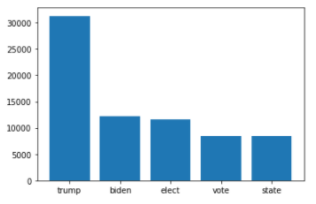

# Information retrieval - Final Project
This repository contains the delivery of the Information Retrieval Final Project, subject taught in the UPF (1st Term 2020). The content of this report contains the recommended structure provided by the Project Guidelines.

## Content

**Section 1 - Data collection**

- Here the information about the data collection, like the aggregated statistics of the collected data (number of tweets, number of users, etc..)
- the keywords used for the data collection
- the approximate time needed to collect the data.

**Section 2 - Search Engine**

Without considering the GitHub repo:
- Description of the pre-processing strategy
- WordCloud generated by the whole corpus (or at least a relevant sample). Only the words considered for the inverted index have to be included.
- Bar plot of the 10 most frequent words (same set of the WordCloud)
- Description and example to describe your score to rank the documents
- Screenshot to compare the difference between the classical ranking and the one by your score (screenshot of the output generated by the search-engine)

**Section 3 - RQs**

- _Subsection RQ1_
    - List of 10 selected queries
    - Answer to Question d
    - Output given by T-SNE
    - Answer to question RQ 1A - reasoning and plots may help.
    - Answer to question RQ 1B - a table for each cluster may help.

- _Subsection RQ2_
    - Describe the diversity score and the post-processing strategy
    - List of chosen queries. 
    - Answer to RQ 2A - plots and tables may help
    - Answer to RQ 2B - plots may help

- _Subsection RQ3_
    - Summary statistics of the retweet graph, train and test.
    - Answer to RQ 3A - tables and details about trained models may help
    - Answer to RQ 3B - Proposed algorithm and table of the performances

### Section 1 - Data Collection

**1.1 Information about the data collection** 

This subsection contains the number of original tweets and the number of retweets.

- Total number of tweets: 100.000

- Original tweets number: 
- Number of retweets:

**1.2 Keywords used for the data collection**

The keywords used for the data collection was to try to get as much tweets as possible about the US Elections. Here are the keywords:  _Donald, Trump, Joe, Biden, America, USA, fraud, Pennsylvania, Georgia, Republicans, Democrats, Votes, States_. By selecting these keywords, we tried to summarize the main topics about the US Elections, and the words have been selected by watching the latest news, no scientific method used here.

**1.3 Time needed to collect the data**

The time spent to collect 100k data has been quite long, and we tried to parallelize the process. However, the Twitter API do not allow to have more than 1 process per account running. Here is the time that we needed to collect 100k

- Data collection time for 100k Tweets = 2000s = 33 min

### Section 2 - Search Engine
**2.1 Preprocessing strategy**

The preprocessing strategy was the first big obstacle that we had to face and we spent most of the project time tuning it. At the end we end it up with the following pipeline:

_Collection_

- 1st: Collection of tweets using the StreamListener of Tweepy and save it a JSON file that we named it _tweets_US_Election_2020.json_

_Initialization_

- 2nd: Read the JSON file containing the tweets to a pandas dataframe, in order to be able to manipulate the data afterwards easily.

- 3rd: Set the real text of each tweet, because some of them are truncated and we need the full content to output the ranking. 

- 4th: Since the collected tweets are a mix of original tweets and retweets, we created a second dataframe only containing the original tweets. To do so, we transformed all the retweets to original tweets by getting the `retweeted_status` field. However, that lead us to have repeated tweets (The same tweet can be retweeted infinite times), so to avoid that we dropped duplications. 

  This approach might not be the best, because perhaps the information that we get is not fully updated (we can get a tweet that is not the most updated,but pruned instead), but we did not wanted to spend more time here, since the practice goal is not this one. Everything said, the collected data is good enough to use it as the database of the ranking system.

_Normalization_

- 5th: Remove the links of each tweet, because we considered them not necessary for the ranking system.
- 6th: Text normalization, which includes:
  - Decompression of words: some words are shorten (do not = don't). We created a set of substitutions to transform "don't" to "do not"
  - Punctuation removal: deleting punctuation such as (",", ".", ";", etc.)
  - Removal of stop words: stop words are the most frequent words and they affect the final output of the ranking system. So, we just removed them. We also added the word "RT" to the stop word list, because that word does not give significant information, it is just a flag to indicate if it is a retweet or not.
  - Stemming: to significantly reduce the vocabulary to only "root" words

_Results presentation_

- 7th: creation of a simplified database that will only contain the output shown to the user. This database is only used to tell the search engine the set of tweets to be shown, all the operations are done in the attribute "original_tweets".  

_Search engine_

- 8th: the search engine is executed with the functions `run` or `run_g`, which corresponds to:
  - Run: run TF-IDF + Cosine similarity or Word2Vec + Cosine similarity. By default it runs TF-IDF, but you can choose to use Word2Vec by calling the function `change_user_input()` located in `tweet_ranking.py`. If you put `1`, it will set TF-IDF as the model, but if you put 2, it will set Word2Vec as the model.
  - Run_g: run our custom scoring function, which considers the number of retweets, replies and likes counters.

**2.2 WordCloud**

The wordcloud has been generated by considering the inverted index. A word will be more relevant if it appears in many documents. This is the result:

**2.3 Bar plot of the most frequent words**

Here is the bar plot of the most frequent words:

**2.4 Custom score explanation**

Our scoring function is simple and only contains the mandatory fields requested in the project. This is the scoring function:

- score = (TF-IDF/Word2Vec + Cosine Similarity) + 3/6 * num_retweets + 2/6 * num_likes + 1/6 * replies_count

We added more weight to the number of retweets, because we thought that the retweet is the main source of expansion. The number of likes is in the second position, since it also contributes in the tweet positioning within Twitter. Finally, we have the replies count that we think that it does not add much value.

Here we have 2 images, where the first image is TF-IDF + Cosine Similarity and the second one is the custom score:

[image] [image]

**Section 3 - RQs**

_Subsection RQ1_

*RQ1.1 Query list:*

The queries we have selected for testing are short, because the fact that the search is performed including ALL the words of the query, as requested in the project statement, and if we put many words very few tweets will satisfy AND condition. The thought behind those queries are extracted by our knowledge about the US elections. Here are the queries:

- _joe biden won elections_
- _donald trump is the president_
- _elections are a fraud_
- _pennsylvania_
- _trump out_
- _votes are fraud_
- _i voted_
- _trump team_
- _biden team_

_Can you imagine a better representation than word2vec? Justify your answer. (**HINT** - what about Doc2vec? Sentence2vec? Which are the pros and cons?)_

Word2Vec representation gives a representation of the semantics of each word, which depending on the architecture allows us to predict words meaning given the context(Continuous-Bag-of-Words), or predict the context given some word (Continuous Skip-grams). while Sentence2Vec/Doc2Vec gives semantics for whole sentences or documents, and depending on the architecture it can provide probabilities for given words given all the sentences(Distributed Memory) or give the probability of a context given some document (Distributed Bag-of-words). 

In our case, Doc2Vec might be a better choice than Word2Vec, because it gives a better positioning in the context than Word2Vec. Perhaps, the granularity that Word2Vec is lost, because now we are analyzing at the sentence level and the semantics of each word is not kept, but in our case that is not a big deal. However, if we are interested also in the word semantics, Word2Vec can be also do a very decent job, because we can always emulate the Sentence2Vec/Doc2Vec by averaging the embedding of the words. 

Alternatively, as shown in the "query suggestion" practice, the problem with word2vec is that a word cannot be embedded if it is not in the dictionary during the training. There are many cases where the user fails putting the right word and that might lead to a potential failure of the search engine.  FastText is an alternative that was shown in class, which allowed misspellings. This is ideal for our search engine, since it is not rare those kind of mistakes.

*RQ1.2 T-SNE plot:*

Here we provide the T-SNE plot requested, with already applied clustering using K-means. As you can see in the image, we have a problem when clustering the data and we did not know how to tune the algorithm to make it work. We also tried with other algorithms provided by the library Sklearn, such as:  DBSCAN, OPTICS, MeanShift, GaussianMixture and AgglomerativeClustering. Nonetheless, we think that we did not tune them well, and the outputs were something similar to the image below. Despite these problems, we just accepted the output to be able to do RQ2 and answer the questions of RQ1.

*RQ1.3 A:*

Visually, we identified 7 clusters, but according to the Elbow method ([Determining The Optimal Number Of Clusters: 3 Must Know Methods - Datanovia](https://www.datanovia.com/en/lessons/determining-the-optimal-number-of-clusters-3-must-know-methods/)) , the optimal clustering was 3. We attach here the elbow graph, and the image is identical of the T-SNE plot, because it already includes the clustering.

*RQ1.3 B:*

In the code, we extracted the TOP 5 most frequent words for each cluster, but since the clustering failed, and the 3 clusters are getting many tweets from the big cluster, which can be seen visually, the most frequent words are the same for each of the clusters. So, answering the question of how well does the keyword explain the cluster, for our case it does not provide a clear separation of the clusters.

_Subsection RQ2_

*RQ2.1 Describe the diversity score and the post-processing strategy:*

The diversity score is computed by looking at the dominance of each cluster in the top 20 ranking.